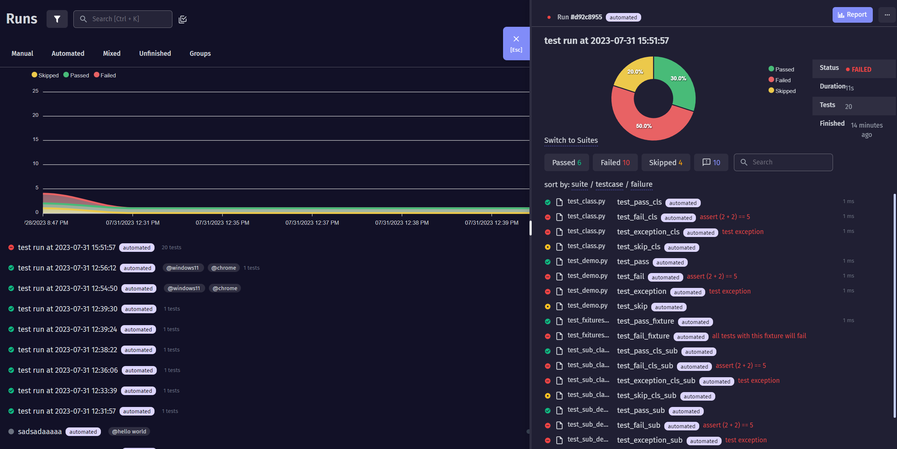

# Test-analyzer demo project
This pytest project demonstrates how to configure and use **test-analyzer** pytest plugin.

## Installation
To install the project dependencies, run the following command:
```bash
pip install -r requirements.txt
```
pytest, requests and autopep8 modules will be installed automatically as dependencies of test-analyzer.  
Pypi package: https://pypi.org/project/pytest-analyzer/

## Usage
1. Create project in https://app.testomat.io/
2. Navigate to project settings and copy the project token

3. Set project token to pytest.ini file as well as email and password of your testomat.io account
```ini
[pytest]

testomatio_project = <api token>
testomatio_email = example@test.com
testomatio_password = secure_password 
```
4. Copy your tests to testomat.io
```bash
pytest --analyzer add
```
5. Run tests and save results to testomat.io
```bash
pytest --analyzer sync
```
6. Set test run environment using additional parameter. There can be several envs, coma separated, no spaces
```bash
ytest --analyzer sync --testRunEnv windows11,chrome,
```
7. Enjoy your test results in testomat.io
